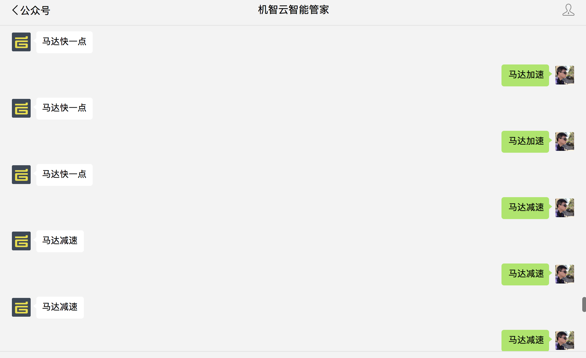
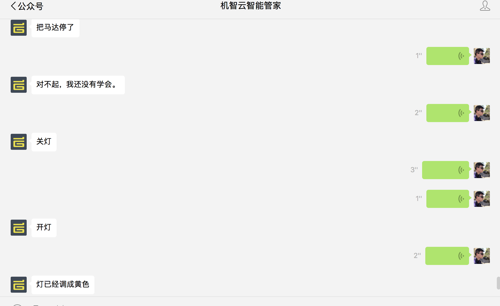

###  菜鸟也能也学会基于物联网开发智能家居

本教程案例是基于机智云物联网平台开发的智能家居案例

###  开发环境

* 1.macbook/windows/linux
* 2.jdk8/idea 
* 3.gokit开发板套件
* 4.微信订阅号
* 5.反向代理工具

###  使用的相关技术
* 1.netty/nio
* 2.spring-boot
* 3.webscoket
* 4.docker
* 5.语音识别


### docker部署 

docker-compose.yml

```

log:
  container_name: log
  image: daocloud.io/gizwits2015/log-collection
  working_dir: /data
  volumes:
    - ./log:/data
  ports:
    - "8080:8080"
  environment:
    SECURITY_USER_NAME: "admin"
    SECURITY_USER_PASSWORD: "123456"
    LOGMONITOR_LOGPATH: "/data/log-collection.log"
    APP_PRODUCT_KEY: "xx"
    APP_DID: "xx"
    APP_MAC: "xx"
    APP_AUTH_ID: "xx"
    APP_AUTH_SECRET: "xx"
    APP_SUBKEY: "client"
    APP_PREFETCH_COUNT: 50
    WECHAT_MP_APPID: "xx"
    WECHAT_MP_SECRET: "xx"
    WECHAT_MP_TOKEN: "weixin"
    WECHAT_MP_AESKEY: "xx"
    SEMANTIC_API: "xx"

```

###  日志监控及采集

```
http://localhost:8080/logMonitor

```

###  设备控制API

```
http://localhost:8080/swagger-ui.html

```


```
curl -X POST --header 'Content-Type: application/json' --header 'Accept: application/json' -d '{ \ 
   "mac": "xx", \ 
   "did": "xx", \ 
   "cmd": { \ 
     "LED_OnOff": false, \ 
     "LED_Color": "紫色", \ 
     "Motor_Speed": 0 \ 
   } \ 
 }' 'http://localhost:8080/dev/control'
```
 
 
 
 #### 部分语音和文本控制设备
 
 
 
 
 
 
 
说明:部分使用的的依赖库需要开发源码编译,如下

```
<dependency>
    <groupId>com.gizwits.noti2</groupId>
    <artifactId>noti-netty-client</artifactId>
    <version>1.0</version>
 </dependency>
        
```

* [机智云开发者平台](http://dev.gizwits.com/)
* [Snoti](http://docs.gizwits.com/zh-cn/Cloud/NotificationAPI.html)
* [noti-netty-client](https://github.com/Bestfeel/noti-netty-client)
* [机智云API文档列表](http://swagger.gizwits.com/doc/menu)